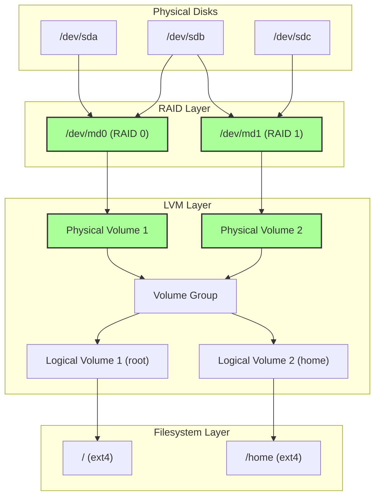
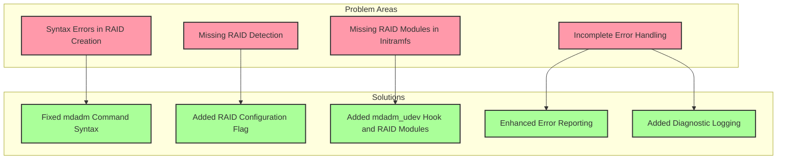
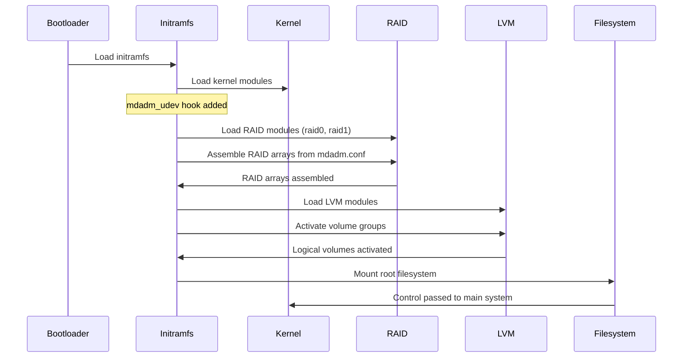
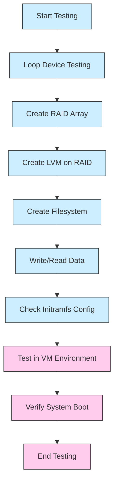

# RAID and LVM Compatibility - Visual Diagrams

## Architecture Overview

## Problem Areas and Solutions

## Boot Process with RAID and LVM

## Testing Flow

These diagrams illustrate:
1. The architecture of a system using both RAID and LVM
2. The problem areas we identified and our solutions
3. The boot process with our RAID and LVM compatibility fixes
4. The testing flow to verify our changes

The diagrams should help visualize how RAID and LVM interact and how our changes ensure compatibility between these technologies.